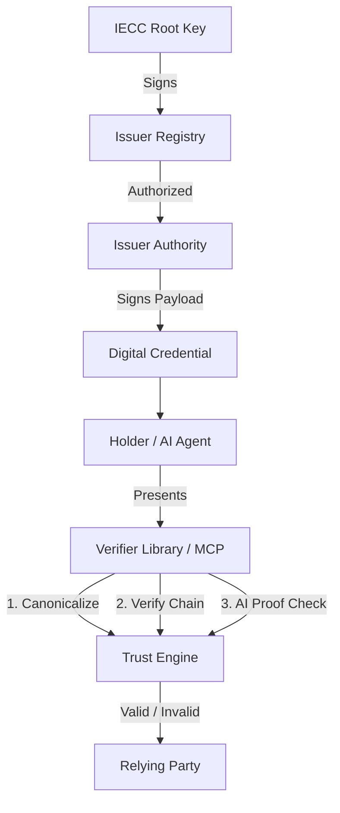

# IECC Verifier (Open Source Trust Protocol)

[](https://opensource.org/licenses/MIT)
[](#technical-specifications)
[](#ai--agent-integration)
[](https://www.npmjs.com/package/@iecc/verifier)

The IECC Verifier is an industrial-grade cryptographic toolkit designed to validate **digital credentials**, **AI-generated content**, and **verifiable achievements** issued through the [IECC Network](https://iecc.world).

---

## 🏗 System Architecture



## 🚀 Frontier AI Features

- **Model Context Protocol (MCP)**: Native support for AI Agents (Claude/ChatGPT). Deploy as `stdio` for local tools or `HTTP` for cloud services.
- **Verifiable AI Inference**: Cryptographic proof that content originated from a specific certified AI model (e.g., DeepSeek, GPT-4), preventing "human-in-the-loop" spoofing.
- **Visual Audit Skill (Vision)**: Multi-modal agents can "read" certificates via OCR and verify embedded trust anchors in real-time.
- **WASM-Optimized**: High-performance, private verification in Browser, Edge, and TEE (Trusted Execution Environments).

---

## 🛠 Key Features

- **Zero-Knowledge Architecture**: Validate credentials without calling a central database, ensuring maximum privacy and GDPR compliance.
- **Deterministic Trust**: Built on **Ed25519** and **JSON Canonicalization (RFC 8785)** for consistent, tamper-proof verification.
- **Dynamic Registry**: Load and verify the trusted issuer list via the **IECC Root Trust Anchor**, supporting real-time revocation.
- **Merkle Tree Batching**: High-throughput verification for bulk-issued credentials.

---

## 📦 Integration Guide

### 1. Installation
```bash
npm install @iecc/verifier
```

### 2. Basic Verification
```typescript
import { verifyCredential } from '@iecc/verifier';

const { isValid, data, error } = await verifyCredential(payload, signature, publicKey);

if (isValid) {
  console.log(`Verified subject: ${data.subject}`);
}
```

### 3. Dynamic Registry & Root Trust (Production)
```typescript
import { loadIssuerRegistryFromUrl, verifyCredentialWithIssuers } from '@iecc/verifier';

// Load the official IECC signed issuer list
const { issuers, verify } = await loadIssuerRegistryFromUrl('https://registry.iecc.world/issuers.signed.json');
if (!verify.isValid) throw new Error("Registry trust failure");

const result = await verifyCredentialWithIssuers(payload, signature, publicKey, issuers);
```

### 4. Verifiable AI Inference
```typescript
import { verifyAIInference } from '@iecc/verifier';

const result = await verifyAIInference(content, aiProof);
console.log(`AI Model: ${result.modelId}, Integrity: ${result.isValid}`);
```

---

## 🤖 MCP Server Deployment

The IECC Verifier provides a powerful MCP server to empower AI Agents.

### Mode A: Local (Claude Desktop)
Add to your config:
```json
"iecc-verifier": {
  "command": "node",
  "args": ["/path/to/mcp-server/dist/index.js", "--stdio"]
}
```

### Mode B: Cloud (HTTP Service)
Perfect for Docker/Kubernetes deployments:
```bash
node dist/index.js --port 3000
```
- **Endpoint**: `POST http://localhost:3000/mcp`
- **Security**: Includes built-in DNS rebinding protection.

---

## 🛠 Developer Workflow

### Monorepo Setup
```bash
# Install all deps (root)
npm install
# Build library & MCP server
npm run build:all
# Run tests
npm test
```

### Packaging Check
```bash
npm run pack:check
```

---

## 📜 Technical Specifications

- **Curve**: Ed25519 (RFC 8032)
- **Hashing**: SHA-256 (Merkle), SHA-512 (EdDSA)
- **Payload**: JSON Canonicalization Scheme (RFC 8785)
- **Trust Anchor**: IECC Root Public Key (Hardcoded in `registry.ts`)

---

## 🌍 Why this exists?

Most digital certificates are just rows in a private database. If the issuer disappears, the certificate dies. **IECC** flips the script: the **proof** belongs to the individual. By open-sourcing the verifier, we ensure that trust is built on math and transparency, not proprietary APIs.

---
© 2026 IECC Network. Independent. Immutable. Verifiable.
