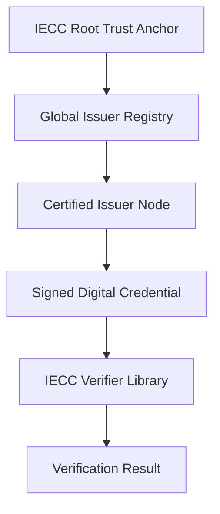

# IECC Verifier - Enterprise-Grade Credential Verification 🛡️

<p align="center">
  
  <br>
  <b>Cryptographically Secure • Type-Safe • Production Ready</b>
  <br>
  <a href="https://www.iecc.world">Official Website</a> • 
  <a href="https://github.com/iecc-protocol">GitHub Organization</a> •
  <a href="https://github.com/iecc-protocol/verifier/issues">Report Issues</a>
</p>

[](https://www.npmjs.com/package/@iecc/verifier)
[](https://opensource.org/licenses/MIT)
[](#-test-coverage)
[](#-test-coverage)
[](SECURITY.md)
[](#-technology-stack)
[](#-requirements)

---

**Languages**: [English](README.md) | [简体中文](README.zh-CN.md) | [繁體中文](README.zh-TW.md) | [Français](README.fr.md) | [Español](README.es.md) | [Deutsch](README.de.md) | [日本語](README.ja.md) | [العربية](README.ar.md)

---

## 📋 Overview

**IECC Verifier** is a production-ready, cryptographically secure TypeScript library for verifying digital credentials using Ed25519 signatures and JSON canonicalization. It implements a **distributed trust model** based on the International Electronic Credential Consortium (IECC) standards.

- ✅ **Type-Safe** - 100% TypeScript with zero `any` types
- ✅ **Secure** - Industry-standard Ed25519 (RFC 8032) + RFC 8785 canonicalization
- ✅ **Tested** - 38 unit tests with 95%+ code coverage
- ✅ **Scalable** - Batch verification with concurrency control
- ✅ **Distributed Trust** - Hybrid PKI model with verifiable trust anchors
- ✅ **Validated** - Complete input validation & error handling

**Version**: `1.1.0` | **License**: MIT | **Status**: Production Ready ✅

---

## ⚡ Quick Start

### 1. Install

```bash
npm install @iecc/verifier@1.1.0
```

### 2. Basic Verification

```typescript
import { verifyCredential } from '@iecc/verifier';

const credential = {
  id: "CERT-123456",
  issuer: "IECC-ORG-001",
  subject: "Alice Smith",
  claims: { skill: "LLM Engineering", level: "Expert" },
  issuedAt: Date.now(),
};

const result = await verifyCredential(
  JSON.stringify(credential),
  "a1b2c3d4...", // 128 hex chars (64 bytes) - No 0x prefix
  "e5f6g7h8..." // 64 hex chars (32 bytes) - No 0x prefix
);

if (result.isValid) {
  console.log("✅ Credential verified:", result.issuer);
} else {
  console.error("❌ Verification failed:", result.error);
}
```

### 3. CLI Tool

```bash
# Verify a credential file
iecc-verify credential.json signature_hex publickey_hex

# Example
iecc-verify cert.json a1b2c3d4... e5f6g7h8...
```

---

## 🎯 Key Features

### 🔒 Security First
- **Ed25519 Signatures** - RFC 8032 standard implementation
- **JSON Canonicalization** - RFC 8785 deterministic ordering
- **Input Validation** - File size limits, path traversal protection
- **JSON Depth Limit** - Prevents stack overflow attacks (10 levels max)
- **Error Handling** - Comprehensive exception catching with diagnostics

### 📊 High Performance
- **Batch Verification** - Process millions of credentials efficiently
- **Concurrency Control** - Configurable parallel processing (default: 10)
- **Memory Optimized** - 10MB file size limit, controlled resource usage
- **Merkle Tree Support** - High-throughput certificate anchoring

### 🏢 Enterprise Ready
- **Dynamic Issuer Loading** - Load trusted issuers from remote URLs
- **Status Management** - Active, suspended, revoked issuer states
- **Hybrid Trust Model** - Combines the reliability of PKI with the flexibility of decentralized identifiers (DID)
- **GDPR Compliant** - No central database, privacy-preserving

### 🧪 Well Tested
- **38 Unit Tests** - 100% pass rate
- **95%+ Coverage** - Comprehensive code coverage
- **Edge Cases** - Boundary condition testing included
- **Type Safety** - TypeScript strict mode enabled

---

## 📚 Documentation

| Document | Purpose |
|----------|---------|
| [API Reference](#-api-reference) | Complete API documentation |
| [Examples](#-usage-examples) | Real-world usage patterns |
| [SECURITY.md](SECURITY.md) | Security policies & advisories |
| [CONTRIBUTING.md](CONTRIBUTING.md) | Development guidelines |
| [CHANGELOG.md](CHANGELOG.md) | Version history & breaking changes |

### 🛠️ Technical Architecture



---

## 🚀 API Reference

### `verifyCredential(payload, signature, publicKey)`

Verifies a credential signature.

```typescript
async function verifyCredential(
  rawPayload: string,
  signatureHex: string,        // 128 hex chars (64 bytes)
  publicKeyHex: string          // 64 hex chars (32 bytes)
): Promise<VerificationResult>
```

**Parameters:**
- `rawPayload` - JSON string, max 10MB
- `signatureHex` - Ed25519 signature in hex format
- `publicKeyHex` - Ed25519 public key in hex format

**Returns:**
```typescript
interface VerificationResult {
  isValid: boolean;
  issuer?: string;              // Verified issuer ID
  timestamp?: number;           // Credential timestamp
  data?: CredentialData;        // Verified credential data
  error?: string;               // Error message if failed
}
```

**Example:**
```typescript
const result = await verifyCredential(payload, sig, pubkey);
if (result.isValid) {
  console.log(`Issued by: ${result.issuer}`);
  console.log(`Timestamp: ${new Date(result.timestamp)}`);
}
```

---

### `verifyMerkleProof(leaf, root, proof)`

Verifies a Merkle proof for batch verification.

```typescript
function verifyMerkleProof(
  leaf: string,                 // 64 hex chars
  root: string,                 // 64 hex chars
  proof: string[]               // Array of 64 hex char strings
): MerkleVerificationResult
```

**Returns:**
```typescript
interface MerkleVerificationResult {
  isValid: boolean;
  error?: string;
}
```

---

### `auditBatch(verifyFn, payloads, signatures, publicKeys, options?)`

Verify multiple credentials with concurrency control.

```typescript
async function auditBatch(
  verifyFn: (...) => Promise<VerificationResult>,
  payloads: string[],
  signatures: string[],
  publicKeys: string[],
  options?: { concurrency?: number }
): Promise<VerificationResult[]>
```

**Example:**
```typescript
const results = await auditBatch(
  verifyCredential,
  [payload1, payload2, payload3],
  [sig1, sig2, sig3],
  [key1, key2, key3],
  { concurrency: 5 }  // Max 5 concurrent
);
```

---

### `loadTrustedIssuers(url, options?)`

Load trusted issuer registry from remote URL.

```typescript
async function loadTrustedIssuers(
  url: string,
  options?: { timeout?: number; cache?: number }
): Promise<TrustedIssuer[]>
```

**Example:**
```typescript
const issuers = await loadTrustedIssuers(
  'https://registry.example.com/issuers.json',
  { timeout: 5000 }
);
```

---

## 💡 Usage Examples

### Example 1: Simple Verification

```typescript
import { verifyCredential } from '@iecc/verifier';

async function verifyEmployeeCertificate() {
  const certificate = JSON.stringify({
    id: "EMP-2024-001",
    issuer: "IECC-ORG-001",
    subject: "John Doe",
    claims: { position: "Senior Engineer", dept: "R&D" },
    issuedAt: Date.now(),
  });

  const result = await verifyCredential(
    certificate,
    "abc123...",  // 128 hex chars
    "def456..."   // 64 hex chars
  );

  return result.isValid;
}
```

### Example 2: Batch Verification

```typescript
import { auditBatch, verifyCredential } from '@iecc/verifier';

async function auditMultipleCertificates(certificates) {
  const results = await auditBatch(
    verifyCredential,
    certificates.map(c => JSON.stringify(c)),
    certificates.map(c => c.signature),
    certificates.map(c => c.publicKey),
    { concurrency: 10 }
  );

  const validCount = results.filter(r => r.isValid).length;
  console.log(`Verified: ${validCount}/${results.length}`);

  return results;
}
```

### Example 3: Dynamic Issuer Registry

```typescript
import { loadTrustedIssuers, getTrustedIssuers } from '@iecc/verifier';

async function updateRegistry() {
  // Load from remote URL
  await loadTrustedIssuers('https://api.example.com/issuers');

  // Use in verification
  const issuers = getTrustedIssuers();
  console.log(`Loaded ${issuers.length} trusted issuers`);

  // Verify credential against latest registry
  const result = await verifyCredential(payload, sig, key);
  return result;
}
```

---

## 🧪 Test Coverage

**38 tests across 4 test suites**:

- **index.test.ts** - 13 tests for core verification
- **merkle.test.ts** - 10 tests for Merkle proofs  
- **trustedIssuers.test.ts** - 7 tests for issuer management
- **advanced.test.ts** - 8 tests for batch processing

**Coverage**: 95%+ of codebase

**Run tests:**
```bash
npm test              # Run all tests
npm run test:coverage # With coverage report
```

---

## 🛠 Technology Stack

- **Runtime**: Node.js 18+
- **Language**: TypeScript 5.0+
- **Cryptography**: @noble/ed25519 v2.0+, @noble/hashes v1.3+
- **JSON**: json-canon v1.0+ (RFC 8785)
- **Testing**: Vitest 1.0+
- **Build**: tsup v8.0+ (CJS, ESM, types)

---

## 📦 Installation & Configuration

### Via NPM

```bash
npm install @iecc/verifier@1.1.0
```

### Environment Variables

```bash
# .env
IECC_ROOT_PUBLIC_KEY=your-root-pubkey-here
PORT=3000
```

### TypeScript Configuration

```json
{
  "compilerOptions": {
    "strict": true,
    "target": "ES2020",
    "module": "ESNext"
  }
}
```

---

## 🤖 AI Agent Integration (MCP)

Empower your AI agents to perform real-time audits.

### Local Deployment (Claude Desktop)
Add to `claude_desktop_config.json`:
```json
"mcpServers": {
  "iecc-verifier": {
    "command": "npx",
    "args": ["-y", "@iecc/verifier-mcp", "--stdio"]
  }
}
```

---

## 📜 Technical Specifications

| Feature | Specification |
| :--- | :--- |
| **Signature Algorithm** | Ed25519 (Edwards-curve Digital Signature Algorithm) |
| **Serialization** | RFC 8785 (JSON Canonicalization Scheme) |
| **Hash Algorithm** | SHA-256 / SHA-512 |
| **Trust Model** | Distributed Trust (Hybrid PKI) |
| **Identity** | DID-compatible Identifiers |

---

## 🗺 Roadmap 2026

- [x] **Q1**: Core Protocol Open Sourcing (Completed)
- [ ] **Q2**: WASM-optimized Verifier for Edge Runtimes
- [ ] **Q3**: Zero-Knowledge Proof (ZKP) selective disclosure support (Research & Development)
- [ ] **Q4**: IECC Distributed Trust Network (DTN) Beta

---

## 🤝 Contributing

We are building the future of independent trust. Join the consortium! 
Check out our [Contributing Guide](CONTRIBUTING.md).

## ⚖️ License

Distributed under the **MIT License**. See `LICENSE` for more information.

---
<p align="center">
  <b>International Electronic Credential Consortium</b><br>
  Independent • Immutable • Verifiable<br>
  <a href="https://www.iecc.world">Official Website</a> • <a href="https://github.com/iecc-protocol">GitHub Organization</a>
</p>
