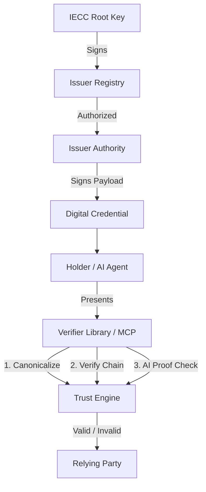

# IECC Verifier (Open Source Trust Protocol) 

[](https://opensource.org/licenses/MIT)
[](https://www.npmjs.com/package/@iecc/verifier)
[](https://github.com/iecc-protocol/verifier/actions)

**IECC (International Electronic Credential Consortium)** Official TypeScript Verification Library.

An independent credential verification protocol designed for the **AI Era**, supporting Ed25519 signatures, RFC 8785 canonicalization, and offline-first verification.

---

## Key Features

- **Deterministic Trust**: Built on **Ed25519** and **JSON Canonicalization (RFC 8785)** for consistent, tamper-proof verification across all platforms (Node/Browser/Edge).
- **AI-Native**: Built-in support for the **Model Context Protocol (MCP)**. AI Agents (e.g., Claude/ChatGPT) can directly invoke this verifier as a tool.
- **High-Throughput**: Supports **Merkle Tree** structures for rapid auditing of bulk-issued credentials.
- **Offline-First**: No central database access required. Trust is established purely via cryptographic proofs, ensuring privacy and GDPR compliance.
- **Lightweight**: Zero-bloat dependencies, optimized for WASM and Edge runtimes.

---

## System Architecture



---

## Quick Start

### Installation

```bash
npm install @iecc/verifier
# or
yarn add @iecc/verifier
```

### Basic Usage (TypeScript/JavaScript)

```typescript
import { verifyCredential } from '@iecc/verifier';

const credential = {
  header: "IECC-v2",
  payload: {
    id: "CERT-12345",
    subject: "John Doe",
    achievement: "Advanced Cryptography",
    issuedAt: "2024-03-15T10:00:00Z"
  },
  signature: "0x..." // Ed25519 hex signature
};

const publicKey = "0x..."; // Issuer Public Key

async function main() {
  const result = await verifyCredential(credential.payload, credential.signature, publicKey);
  
  if (result.isValid) {
    console.log("Credential Verified!");
  } else {
    console.error("Verification Failed:", result.error);
  }
}

main();
```

### Command Line Interface (CLI)

Verify local JSON files directly from your terminal:

```bash
npx iecc-verify --file my-cert.json --key <ISSUER_PUBLIC_KEY>
```

---

## Frontier AI Features

- **MCP Server**: Provides AI Agents with a native "Verification Skill".
    - `stdio` mode: For local desktop agents (e.g., Claude Desktop).
    - `HTTP` mode: For cloud-based agent services.
- **Verifiable AI Inference**: Cryptographic proof that content originated from a specific certified AI model (e.g., GPT-4, DeepSeek), preventing spoofing.

---

## Development

```bash
# Install dependencies
npm install

# Run tests
npm test

# Build project
npm run build
```

---

## Technical Specifications

- **Curve**: Ed25519 (RFC 8032)
- **Hashing**: SHA-256 (Merkle), SHA-512 (EdDSA)
- **Payload**: JSON Canonicalization Scheme (RFC 8785)
- **Trust Anchor**: IECC Root Public Key

---

## Contributing

We welcome community contributions! Please see [CONTRIBUTING.md](CONTRIBUTING.md) for details.

## License

Distributed under the [MIT License](LICENSE).

---

<p align="center">
  Built with ❤️ by <b>IECC Consortium</b><br>
  <a href="https://www.iecc.world">www.iecc.world</a>
</p>
