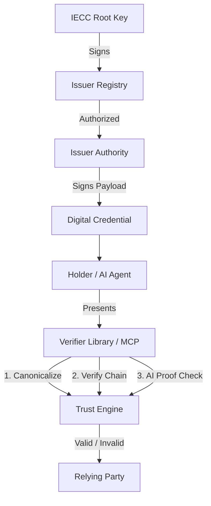

# IECC Verifier (Open Source Trust Protocol)

[](https://opensource.org/licenses/MIT)
[](https://www.npmjs.com/package/@iecc/verifier)
[](https://github.com/iecc-protocol/verifier/actions)

**IECC (International Electronic Credential Consortium)** 官方 TypeScript 验证库。

这是一套为 **AI 时代**设计的独立凭证验证协议，支持 Ed25519 签名、RFC 8785 规范化以及离线验证。

---

## 核心特性

- **确定性信任**: 基于 **Ed25519** 和 **JSON Canonicalization (RFC 8785)**，确保验证结果在任何平台（Node/Browser/Edge）完全一致。
- **AI 原生支持**: 内置 **Model Context Protocol (MCP)** 支持。AI Agent（如 Claude/ChatGPT）可直接调用此验证器。
- **高性能批量验证**: 支持 **Merkle Tree** 结构，适合大规模凭证的快速并发审计。
- **离线优先**: 无需访问中央数据库，完全基于密码学证明进行验证，保护隐私且符合 GDPR。
- **轻量化**: 零臃肿依赖，经过 WASM 优化。

---

## 系统架构



---

## 快速开始

### 安装

```bash
npm install @iecc/verifier
# 或者使用 yarn
yarn add @iecc/verifier
```

### 基础用法 (TypeScript/JavaScript)

```typescript
import { verifyCredential } from '@iecc/verifier';

const credential = {
  header: "IECC-v2",
  payload: {
    id: "CERT-12345",
    subject: "John Doe",
    achievement: "Advanced Cryptography",
    issuedAt: "2024-03-15T10:00:00Z"
  },
  signature: "0x..." // Ed25519 十六进制签名
};

const publicKey = "0x..."; // 发行方公钥

async function main() {
  const result = await verifyCredential(credential.payload, credential.signature, publicKey);
  
  if (result.isValid) {
    console.log("✅ 凭证验证通过！");
  } else {
    console.error("❌ 验证失败:", result.error);
  }
}

main();
```

### 命令行工具 (CLI)

你也可以直接在终端验证本地 JSON 文件：

```bash
npx iecc-verify --file my-cert.json --key <ISSUER_PUBLIC_KEY>
```

---

## Frontier AI 功能

- **MCP Server**: 为 AI Agent 提供原生“验证技能”。
    - `stdio` 模式：适用于本地桌面 Agent。
    - `HTTP` 模式：适用于云端 Agent 服务。
- **Verifiable AI Inference**: 证明内容确实源自特定的受认证 AI 模型（如 GPT-4, DeepSeek），防止伪造。

---

## 开发与测试

```bash
# 安装依赖
npm install

# 运行测试
npm test

# 构建项目
npm run build
```

---

## 许可证

本项目采用 [MIT License](LICENSE) 许可。

## 贡献

我们欢迎社区贡献！请参阅 [CONTRIBUTING.md](CONTRIBUTING.md) 了解更多细节。

---

<p align="center">
  Built with ❤️ by <b>IECC Consortium</b><br>
  <a href="https://www.iecc.world">www.iecc.world</a>
</p>

---

## Integration Guide

### 1. Installation
```bash
npm install @iecc/verifier
```

### 2. Basic Verification
```typescript
import { verifyCredential } from '@iecc/verifier';

const { isValid, data, error } = await verifyCredential(payload, signature, publicKey);

if (isValid) {
  console.log(`Verified subject: ${data.subject}`);
}
```

### 3. Dynamic Registry & Root Trust (Production)
```typescript
import { loadIssuerRegistryFromUrl, verifyCredentialWithIssuers } from '@iecc/verifier';

// Load the official IECC signed issuer list
const { issuers, verify } = await loadIssuerRegistryFromUrl('https://registry.iecc.world/issuers.signed.json');
if (!verify.isValid) throw new Error("Registry trust failure");

const result = await verifyCredentialWithIssuers(payload, signature, publicKey, issuers);
```

### 4. Verifiable AI Inference
```typescript
import { verifyAIInference } from '@iecc/verifier';

const result = await verifyAIInference(content, aiProof);
console.log(`AI Model: ${result.modelId}, Integrity: ${result.isValid}`);
```

---

## 🤖 MCP Server Deployment

The IECC Verifier provides a powerful MCP server to empower AI Agents.

### Mode A: Local (Claude Desktop)
Add to your config:
```json
"iecc-verifier": {
  "command": "node",
  "args": ["/path/to/mcp-server/dist/index.js", "--stdio"]
}
```

### Mode B: Cloud (HTTP Service)
Perfect for Docker/Kubernetes deployments:
```bash
node dist/index.js --port 3000
```
- **Endpoint**: `POST http://localhost:3000/mcp`
- **Security**: Includes built-in DNS rebinding protection.

---

## 🛠 Developer Workflow

### Monorepo Setup
```bash
# Install all deps (root)
npm install
# Build library & MCP server
npm run build:all
# Run tests
npm test
```

### Packaging Check
```bash
npm run pack:check
```

---

## 📜 Technical Specifications

- **Curve**: Ed25519 (RFC 8032)
- **Hashing**: SHA-256 (Merkle), SHA-512 (EdDSA)
- **Payload**: JSON Canonicalization Scheme (RFC 8785)
- **Trust Anchor**: IECC Root Public Key (Hardcoded in `registry.ts`)

---

## 🌍 Why this exists?

Most digital certificates are just rows in a private database. If the issuer disappears, the certificate dies. **IECC** flips the script: the **proof** belongs to the individual. By open-sourcing the verifier, we ensure that trust is built on math and transparency, not proprietary APIs.

---
© 2026 IECC Network. Independent. Immutable. Verifiable.
